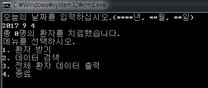
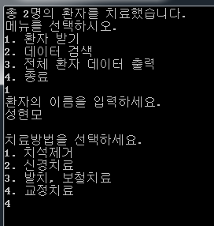
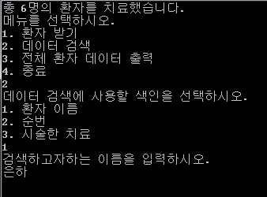
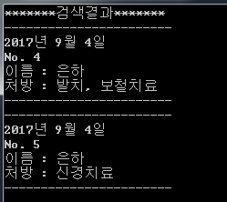
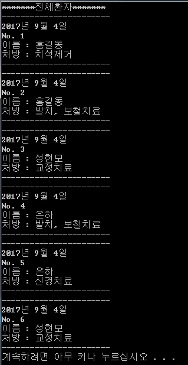

# 치과 환자 관리 프로그램

개요
-------------
본 프로그램은 치과에서 환자 정보를 체계적으로 관리하는 서비스를 제공합니다.  
날짜를 설정하여 환자의 이름, 순번, 처방 데이터를 저장하고 관리할 수 있습니다.  
저장된 환자정보를 검색하거나 출력할 수 있습니다.  
프로그램에 저장된 데이터들은 텍스트(.txt) 파일로 저장됩니다.
+ C++
+ Visual Studio
+ 프로그램 내 환자 정보를 객체 인스턴스화.
+ 환자 객체를 순번 순으로 트리 내 저장.
+ 검색한 환자 정보를 큐에 저장하여, 순번 순으로 출력. 

실행 결과
-------------
+ 날짜를 입력한 후의 메인 메뉴

  

+ 

  

  

  

  

클래스 설계
-------------
+ Application.h
<pre><code>
void Try();									//메인 메뉴 출력
void Input_day(int& year, int& month, int &day);		//날짜 입력받기
int Main_menu();								//메인 메뉴
int Search_menu();								//색인 선택 메뉴 출력
void Search_for_name(StructTree tree, QueType& que);		//이름으로 검색
void Search_for_number(StructTree tree, QueType& que);		//번호로 검색
void Search_for_treat(StructTree tree, QueType& que);		//치료법으로 검색
</code></pre>

+ Patient.h
<pre><code>
private:
	string m_name;		//환자 이름
	int m_number;		//순번
	int m_year;		//치료 년도
	int m_month;		//치료 월
	int m_day;		//치료 일
	string m_treatment;	//치료방법

public:
	void Input_data(int& count, int year, int month, int day);	//이름, 순번, 치료일시 저장
	void Select_treat();						//치료방법 저장
	void Data_copy(Patient data);					//환자 데이터 저장
	void Data_stream(ofstream& file);				//.txt파일에 저장
	void Print_data();						//환자 데이터 출력
	string NameIs();						//환자 이름 리턴
	int NumberIs();							//환자 순번 리턴
	string TreatIs();						//환자 치료방법 리턴
</code></pre>

+ QueType.h
<pre><code>
public: 
    QueType();		//생성자
    ~QueType();		//소멸자
    void MakeEmpty();			//큐를 빈큐로 초기화
    bool IsEmpty() const;		//큐가 비었는지 확인
    bool IsFull() const;		//큐가 꽉찼는지 확인
    void Enqueue(Patient newItem);		//큐에 데이터 in
    void Dequeue(Patient& item);		//큐의 데이터 out
private:
    int front;
    int rear;
    Patient* items;
    int maxQue;
</code></pre>

+ StructTree.h
<pre><code>
public:
	StructTree();			//생성자
	~StructTree();			//소멸자
	void MakeEmpty();		//root를 NULL로 초기화
	bool IsEmpty() const;		//Tree가 비었는지 확인
	int LengthIs() const;		//Tree의 노드 수 리턴
	void Search_name(string name, QueType& que);		//이름으로 검색
	void Search_number(int number, QueType& que);		//순번으로 검색
	void Search_treat(int treat, QueType& que);		//치료방법으로 검색
	void InsertItem(Patient data, ofstream& file);		//트리에 데이터 추가
	void PrintAll(QueType& que);				//트리의 모든 노드 출력
private:
	TreeNode* root;
</code></pre>
